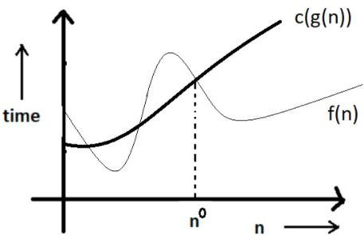
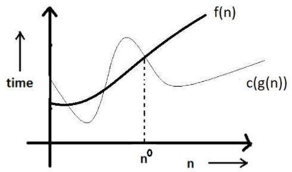
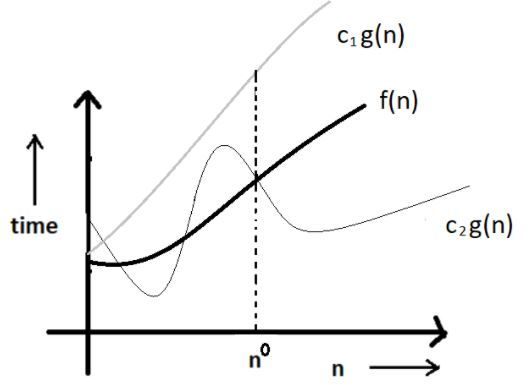

# 1. Introduction to Algorithms

It is a step by step procedure to solve a computational problem.<br>
Now what is a program??<br>
It is also a step by step procedure to solve a computational problem.<br>

**Difference between Algorithm and Program**

| Algorithm | Program |
|-----------|-----------|
| Written at design time.          | Written at implementation time.          |
| Person who should write an algorithm should have domain knowledge of the problem. | Programmer will write the program. |
| Any language (English , mathematical notation) can be used to write an algorithm. | Only written using programming language (like C , C++ , Java , Python etc). |
| Hardware and Operating System independent. | Hardware and Hardware and Operating System dependent. |
| We analyze an algorithm. | We test a program. |

<br>

## 1.1 Priori Analysis and Posteriori Testing

| Priori Analysis | Posteriori Testing |
|---|---|
| Done for Algorithm | Done for a program |
| Independent of language | Language dependent |
| Hardware independent | Hardware dependent |
| We get time and space **function** | We watch time and bytes consumed |

<br>

## 1.2 Characteristics of Algorithm 

1. Input - takes 0 or more inputs.
2. Output - must generate atleast one output otherwise of no use.
3. Definiteness - every statement must be clear. (eg - root(-1) cannot be read as real number).
4. Finiteness - duration of algorithm must be finite.
5. Effectiveness - should not have any unnecessary statements.

<br>

## 1.3 How to Analyze an Algorithm

An algorithm can be anlyzed on the basis of -
1. Time - we get a time **function**.
2. Space - memory space consumption.
3. Network consumption - Nowadays , every application is either internet based , web based or cloud based so data transfer or network consumption is also an important criteria.
4. Power consumption
5. CPU registers - if developing programs for device drivers or system level programming then we also need to know how much CPU registers it is consuming

Consider an algorithm -
```
Algorithm Swap(a, b)
{
    temp = a;     <------ 1 unit time
    a = b;        <------ 1    "
    b = temp;     <------ 1    "
}
```
1. Time Analysis - Generally , we take every statement is consuming 1 unit of time.<br>
So , time taken = f(n) = 3 (constant) OR Order of 1 = O(1)

2. Space Analysis - parameter used = a, b and local variable = temp<br>
So , S(n) = 1+1+1 = 3 words (constant) OR Order of 1 = O(1)

<br>

## 1.4 Frequency Count Method

Consider an algorithm -
```
Algorithm sum(A, n)
{
    s = 0;                 <---- 1 unit time
    for(i=0 ; i<n; i++)    <---- n+1 unit time
    {
        s = s + A[i];      <---- n unit time
    }
    return s;              <---- 1 unit time
}
```

1. Time Analysis - 'i' is incrementing 'n' times but the comparision is done for 'n+1' times ( i=0, i=1, i=2, .... i=n ).<br>
> i=0 ( Assignment Operation ) takes 1( constant ) time, but
we consider only time taken in comparision so time taken by for loop = (n+1) unit time.

Total time taken = 1 + (n+1) + n + 1 = 2n+3.<br>
Degree of this polynomial = 1 OR order of n = O(n)

2. Space Analysis - Variable used are A, n, s, i and size of A is n words.<br>
So , space consumed = n+1+1+1 = n+3 words OR order of n = O(n)

Consider an another algorithm -
```
Algorithm add(A, B, n) 
{
    for(i=0; i<n; i++)                  <------ (n+1) unit time
    {
        for(j=0; j<n; j++)              <------ n*(n+1) unit time
        {
            C[i,j] = A[i,j] + B[i,j];   <------ n*n unit time
        }
    }
}
```

1. Time Analysis - f(n) = (n+1) + n*(n+1) + n*(n) = 2*(n)^2 + 2*n + 1 OR O(n^2)

2. Space Analysis - 

    | Variables | Size |
    |---|---|
    | A | n^2 words |
    | B | n^2 words |
    | C | n^2 words |
    | n | 1 word |
    | i | 1 word |
    | j | 1 word |

    So , S(n) = 3*(n)^2 + 3 OR O(n^2)

Consider another algorithm -
```
Algorithm multiply(A, B, n) 
{
    for(i=0; i<n; i++)                             <------ (n+1) unit time
    {
        for(j=0; j<n; j++)                         <------ n*(n+1) unit time
        {
            C[i,j] = 0;                            <------ n*(n) unit time
            for(k=0; k<n; k++)                     <------ n*n*(n+1) unit time
            {
                C[i,j] = C[i,j] + A[i,k]*B[k,j];   <------ n*(n)*(n) unit time
            }
        }
    }
}
```

1. Time Analysis - f(n) = (n+1) + (n * (n+1)) + (n * n) + (n * (n) * (n+1)) + (n * n * n) = 2*(n)^3 + 3*(n)^2 + 2*n + 1 OR O(n^3)

2. Space Analysis - 

    | Variables | Size |
    |---|---|
    | A | n^2 words |
    | B | n^2 words |
    | C | n^2 words |
    | n | 1 word |
    | i | 1 word |
    | j | 1 word |
    | k | 1 word |

    So , S(n) = 3*(n)^2 + 4 OR O(n^2)

<br>

## 1.5.1 Time Complexity #1

1. a)
```
for(i=0; i<n; i++) {
    // statements;      <--- n unit time
}
```
So, Time Complexity = Order of n = ```O(n)```
    
b)
```
for(i=n; i<0; i--) {
    // statements;      <--- n unit time
}
```
So, Time Complexity = Order of n = ```O(n)```

2. a)
```
for(i=1; i<n; i+2) {
    // statements;      <--- n/2 unit time
}
```
So, Time Complexity = Order of n/2 = ```O(n)```

b)
```
for(i=1; i<n; i+a) {    // Where a = positive number
    // statements;      <--- n/a unit time
}
```
So, Time Complexity = Order of n/a = ```O(n)```

3. a)     

```
for(i=0; i<n; i++)                             <--- (n+1) unit time
{
    for(j=0; j<n; j++)                         <--- n*(n+1) unit time
    {
        // statements;                         <--- n*n unit time
    }
}
```
So, Time Complexity = Order of n^2 = ```O(n^2)```

b)   

```
for(i=0; i<n; i++)                             
{
    for(j=0; j<i; j++)                         
    {
        // statements;                         
    }
}
```

### **Tracing this code :**

| i | j | No. of times run |
|---|---|---|
| 0 | 0(x) | 0 |
| 1 | 0, 1(x) | 1 |
| 2 | 0, 1, 2(x) | 2 |
| 3 | 0, 1, 2, 3(x) | 3 |

This will continue till i = n, j = 0, 1, 2, 3, 4, .... , n-1

So, Time Complexity = f(n) = 0 + 1 + 2 + 3 + ... + n = (n*(n+1))/2 . So , order of n^2 = ```O(n^2)```.

4. a)     

```
p=0;
for(i=1; p<=n; i++)     <--- (n+1) unit time
{
    p = p + i;
}
```
### **Tracing this code :**

| i | p | No. of times run |
|---|---|---|
| 1 | 0+1=1 | 1 |
| 2 | 1+2=3 | 2 |
| 3 | 1+2+3 | 3 |
| 4 | 1+2+3+4 | 4 |

Let it runs 'k' times such that 'p' becomes > n ,<br>
so  (k*(k+1))/2 > n<br>
=> k^2>n<br>
=> k>root(n)<br>
So, Time Complexity = Order of n^(1/2) = ```O(root(n))```

***Main idea is to find to number of times the code will run till terminating condition is reached***

<br>

## 1.5.2 Time Complexity #2

5.
```
for(i=1; i<n; i=i*2) {
    // statements;
}
```
### **Tracing this code :**

| i |
|---|
| 1 |
| 2*2 |
| (2^2)*2 |
| (2^3)*2 |

Let this continues for k times such that 'i' becomes greater than or equal to n<br>
=> i>=n<br>
=> 2^k >= n<br>
=> k = log(n) on base 2

So, Time Complexity = Order of log(n) = O(log(n)) OR = ```O(ceil(log(n)))```

OR, we can look it as i = 1x2x2x2x2x.....x till 'k' times when i >= n => 2^k = n or ```k = log(n) on base 2```

6.
```
for(i=n; i>=1; i=i/2) {
    // statements;
}
```
### **Tracing this code :**

| i |
|---|
| n |
| n/2 |
| (n/2)/2 |
| (n/(2^2))/2 |

Let this continues for k times such that 'i' becomes less than 1<br>
=> i<1<br>
=> n/(2^k) < 1<br>
=> k = log(n) on base 2

So, Time Complexity = Order of log(n) = O(log(n)) OR = ```O(ceil(log(n)))```

OR, we can look it as i = n/2/2/2/2/...../ till 'k' times when i < 1 => n/(2^k) = 1 or ```k = log(n) on base 2```

7.    

```
for(i=1; i*i<n; i++)                             
{
    // statements;      
}
```
Now, this code will run until i*i >= n<br>
=> 'i' becomes root(n)<br>
So, Time Complexity = Order of n^(1/2) = ```O(root(n))```

8.     
```
for(i=0; i<n; i++)
{
    // statements;      <--- n unit time
}
for(j=0; j<n; j++)      
{
    // statements;      <--- n unit time
}
```
So, Time Complexity = Order of (n+n) = O(2n) = ```O(n)```

9.     
```
p=0;
for(i=1; i<n; i=i*2)
{
    p++;      <--- log(n) unit time , so p will become log(n)
}
for(j=1; j<p; j=j*2)      
{
    // statements;      <--- log(p) unit time
}
```
So, Time Complexity = Order of log(p) = ```O(log(log(n)))``` [As p = log(n)]

9.     
```
for(i=1; i<n; i=i++)        <--- n unit time [you can take it 'n' instead of 'n+1']
{
    for(j=1; j<n; j=j*2)    <--- n*log(n) unit time
    {
        // statements;      <--- n*log(n) unit time
    }
}
```
So, Time Complexity = Order of (2n*log(n) + n) = ```O(n(log(n)))```

**Cases we have disscused so far :**

| Case | Time Complexity |
|---|---|
| for(i=0; i<n; i++) | O(n) |
| for(i=0; i<n; i=i+2) | O(n/2) = O(n) |
| for(i=n; i>1; i--) | O(n) |
| for(i=1; i<n; i=i*2) | O(log(n)) , base = 2 |
| for(i=1; i<n; i=i*3) | O(log(n)) , base = 3 |
| for(i=n; i>1; i=i/2) | O(log(n)) , base = 2 |
| for(i=1; i*i<n; i++) | O(root(n)) |

<br>

## 1.5.3 Time Complexity of While and if #3

1. a)
```
i=0;                <--- 1 unit time
while(i<n) {        <--- (n+1) unit time [n times true and 1 time false]
    // statements;  <--- n unit time 
    i++;            <--- n unit time
}
```
So, time taken = f(n) = 1 + (n+1) + n + n = 3n+2 = Order of n = ```O(n)```

b) Equivalent for loop
```
for(int i = 0; i<n; i++) {
    // statements;
}
```
So, time taken = 3n+2 = 1 (for i=0) + (n+1) (for i<n) + n (i++ -> updation) + n (for statements).<br>
If we had not consider time for i=0 and i++ like in previous section , time taken will be equal to (2n+1) = ```O(n)``` [so, nothing is different]
> So, any **for loop** can be changed to **while loop** and vice-versa.

2.
```
a=1;
while(a<b) {
    stmt;
    a=a*2;
}
```

**Tracing the code**
| i | |
|---|---|
| 1|
| 1x2 = 2|
|2x2 = 4|
|4x2 = 8|
|8x2 = 16|
k times...
| 2^k ||

Terminate when 'a' becomes greater than or equal to 'b' => 2^k>=b => 2^k=b => k = log(b) on base 2<br>
So, time taken = f(b) = log(b) => f(n) = log(n) . So, order of n = O(n).

3. 
```
i = n;
while(i>1) {
    stmt;
    i=i/2;
}
```
Let the loop runs for k times until i<=1 => n/(2^k) <= 1 => ```k = log(n) on base 2```
So, time taken = f(n) = log(n) => ```O(log(n))``` 

4. a)
```
i=1;
k=1;
while(k<n) {
    stmt;
    k=k+i;
    i++;
}
```

### **Tracing this code :**

| i (becomes) | k | No. of times run |
|---|---|---|
| 1 | 1 | Initially |
| 2 | 1+1=2 | 1 |
| 3 | 2+2 | 2 |
| 4 | 2+2+3 | 3 |
| 5 | 2+2+3+4 | 4 |
| 6 | 2+2+3+4+5 | 5 |
| m times...| 2+2+3+4+5+...+(m-1)| Sum of first n natural numbers = (m*(m+1))/2

Let it runs 'm' times such that 'k' becomes >= n ,<br>
so  (m*(m+1))/2 >= n<br>
=> m^2>=n  [ROUGHLY]<br>
=> m>=root(n)<br>
So, Time Complexity = Order of n^(1/2) = ```O(root(n))```

b) Equivalent for loop
```
for(k=1,i=1; k<n; i++) {
    stmt;
    k=k+i;
}
```
Time complexity = O(root(n))

5. a) GCD Program
```
while(m!=n) {
    if(m>n) m = m-n;
    else n = n-m;
}
```

**Tracing this code**

|m|n||
|--|--|--|
|CASE 1|
|3|3| Stops here|
|---|---|
|CASE 2||
|6|3|
|3|3| Stops here
|---|---|
|CASE 3||
|14|3|
|11|3|
|8|3|
|5|3|
|2|3|
|2|1|
|1|1| Stops here

Every time it runs approximately floor(n/2) times so 
time complexity = O(n/2) = ```O(n)``` (maximum time)
<br>And, minimum time = O(1) [when both numbers are equal]

b) Equivalent for loop
```
for( ; m!=n; ) {
    if(m>n) m = m-n;
    else n = n-m;
}
```

6.
```
Algorithm Test(n) {
    if(n<5) printf("%d", n);                <--- 1 unit time
    else {
        for(i=0; i<n; i++) printf("%d", i); <--- n unit time
    }
}
```
If condition is true , time complexity = O(1) [Best Case]
<br> If condition is false , time complexity = O(n) [Worst Case]

<br>

## 1.6 Types Of Functions


|Time Complexity|Name| Example
|--|--|--|
|O(1)|Constant| f(n) = 1, 2782, 3 , 598, .... etc.
|O(log(n))|Logarithmic| f(n) = log(n) on base 3 or base 2 etc.
|O(n)|Linear|f(n) = 2n+3, 3n+1, 5n/2342, .... etc.
|O(n^2)|Quadratic| f(n) = 2(n^2)+4, n^2+9, ... etc.
|O(n^3)|Cubic| f(n) = 2(n^2)x4, nx2+9, ... etc.
|O(2^n)|Exponential| f(n) = 2^n+4, (2^n)/328, ... etc. 
|O(3^n)|Exponential|
|O(n^n)|Exponential|

<br>

## 1.7 Comparing types of functions

[**INCREASING WEIGHTAGE**]
```
1 < log(n) < root(n) < n < nlog(n) < n^2 < n^3 < ....... < 2^n < 3^n ....... < n^n
```

|log(n)|n|n^2|2^n|
|--|--|--|--|
|0|1|1|2|
|1|2|4|4|
|2|4|16|16|
|3|8|64|256|
|3.169|9|81|512|

**Graph**
> https://www.desmos.com/calculator/a0oswh1udb

<br>

## 1.8.1 Asymptotic Notations - Big Oh , Omega , Theta #1

|Notation|Function||
|--|--|--|
|(O) Big Oh|Upper Bound|
|(Ω) Big Omega|Lower Bound|
|(θ) Theta|Average Bound| **USEFUL**

- Theta noation is most useful among the three notation , so why other notations ?<br>
If we cannot specify the exact place of any function , then we can show the upper bound of the function.

- Time Complexity of any function will be a multiple of one among these - 
```
1 < log(n) < root(n) < n < nlog(n) < n^2 < n^3 < ....... < 2^n < 3^n ....... < n^n
```
If we don't get time complexity as a multiple of these , then we may not be able to represent theta(θ) then we can go for big Oh(O) or omega(Ω) notation.

### **Big Oh(O) Notation**

<br>



<br>

```The function f(n) = O(g(n)) iff there exists a +ve constant c and n0 such that f(n)<=c*g(n) for all n >= n0```

eg- f(n) = 2n+3

**CASE I** - for f(n) = 2n+3 , g(n) = 10n .<br>
Now, 2n+3 <= 10n for all n>=1 , c=10. So , f(n) = O(g(n)) = O(n)<br>

**CASE II** - for f(n) = 2n+3 , g(n) = 7n .<br>
Now, 2n+3 <= 7n for all n>=1 , c=7. So , f(n) = O(g(n)) = O(n)<br> 

> Now, g(n) can be (5n, 7n, 456n, 3353n , .... etc) +3 which statifies ```f(n) <= c*g(n)```

**Here simplest method to get g(n) is to make both sides multiple of n**

**CASE III** - for f(n) = 2n+3 , g(n) = 2n+3n = 5n , c=5<br>
Now , for n=1 , 2n+3 <= 5n => 5<=5 (**Border Case**) for all n>=1. So , f(n) = O(n)

<br>

**CASE IV** - if we make g(n) as multiple of n^2<br>
2n+3 <= 2n^2 + 3n^2 = 5n^2 for all n>=1 , c=5 . So f(n) is also = O(n^2) 

So , ```n < nlog(n) < n^2 < n^3 < ....... < 2^n < 3^n ....... < n^n``` becomes upper bound of function. [```Big Oh```]

And , ```1 < log(n) < root(n) < n``` are lower bound for f(n) = 2n+3.[```Omega```]

And , average bound = ```O(n)```.[```theta```]

> We try to write the closest function so ```f(n) = O(n)``` here. 

### **Omega(Ω) Notation**

<br>



<br>

```The function f(n) = Ω(g(n)) iff there exists a +ve constant c and n0 such that f(n)>=c*g(n) for all n >= n0```

eg - f(n) = 2n+3

**CASE I** - for f(n) = 2n+3 , g(n) = 1n .<br>
Now, 2n+3 >= 1n for all n>=1 , c=1. So , f(n) = Ω(g(n)) = Ω(n)<br>

We can write f(n) = Ω(log(n)) [```Lower Bound```].

> But, we cannot write f(n) as Ω(n^2) or Ω(n^3) ,... as these are upper bounds.

> We take the closest function so f(n) = Ω(n).

### **Theta(θ) Notation**

<br>



<br>

```The function f(n) = θ(g(n)) iff there exists a +ve constant c1, c2 and n0 such that c1*g(n)<=f(n)>=c2*g(n) for all n >= n0```

eg- f(n) = 2n+3

1n <= 2n+3 <= 5n , for all n>=1 and c1=1 , c2=5 , g(n) = n

> Here , g(n) cannot be either ```1 < log(n) < root(n)``` or ```nlog(n) < n^2 < n^3 < ....... < 2^n < 3^n ....... < n^n```.

>**IMPORTANT** -  Don't MIX this with best case , average case and worst case of a function. We can use any notation for best case , average case and worst case of a function. We will see it later.

<br>

## 1.8.2 Asymptotic Notations - Big Oh - Omega - Theta #2

**T.C. Order** 

```1 < log(n) < root(n) < n < nlog(n) < n^2 < (n^2).log(n) n^3 < ..... < 2^n< 3^n ..... < n^n```

eg - for function, f(n) = 2*(n^2) + 3n + 4

2*(n^2) + 3n + 4 <= 2*(n^2) + 3*(n^2) + 4*(n^2)<br>
=> 2*(n^2) + 3n + 4 <= 9*(n^2) , **where c = 9, g(n) = n^2, n>=1**<br>
So, **Upper Bound for f(n) = O(g(n)) = ```O(n^2)```**

And , 2*(n^2) + 3n + 4 >= 1*(n^2) => **Lower Bound, ```Ω(n^2)```**

```So ,  1*(n^2) >= 2*(n^2) + 3n + 4 <= 9*(n^2)```<br>
Hence, **tight bound ```θ(g(n)) = θ(n^2)```** 

eg - f(n) = (n^2).log(n) + n
 
Now, (n^2).log(n) <= (n^2).log(n) + n <= 10*(n^2).log(n)<br>
So, **Upper, Lower, and Tight bound are ```O((n^2).log(n)), Ω((n^2).log(n)) and θ((n^2).log(n))```** respectively.

eg - f(n) = n! = n*(n-1) * (n-2) * (n-3) * (n-4) * .... * 2 * 1

Now, 1 * 1 * 1 * ... (n times) * 1 <= 1 * 2 * 3 * .... * n <= n * n * n * ... (n times) * n <br>
=> 1 <= n! <= n^n <br>
So , **upper and lower bounds are ```O(n^n) and Ω(1)``` respectively** . We ```cannot find tight bound``` here.

eg - f(n) = log(n!) 

Now, log(1) <= log(n!) <= log(n^n)<br>
=>  log(1) <= log(n!) <= nlog(n)<br>
So, **upper and lower bound of f(n) = ```O(nlog(n)) and Ω(1)```**

<br>

## 1.9 Properties of Asymptotic Notations

### General Properties

- ```If f(n) is O(g(n)) then a*f(n) is also O(g(n))```. **[a = constant]**

eg - f(n) = 2*(n^2) + 5 is O(n^2)<br>
then, 7 * f(n) = 7*(2*(n^2) + 5) = 14.(n^2) + 35 is O(n^2)

> Applicable to all three notations.

- **Reflexive Property** - ```if f(n) is given then f(n) = O(f(n))```.

eg - If, f(n) = n^2 then f(n) = O(f(n)) = O(n^2).

- **Transitive Property** - ```if f(n) is O(g(n)) and g(n) is O(h(n)) then f(n) = O(h(n))```.

eg - f(n) = n , g(n) = n^2 , h(n) = n^3.<br>
Here by observation , f(n) = O(g(n)) = O(n^2) , g(n) = O(h(n)) = O(n^3) , also f(n) = O(h(n)) = O(n^3).

- **Symmetric Property** - ```if f(n) is θ(g(n)) then g(n) is θ(f(n))```.

eg - f(n) = n^2 , g(n) = n^2.<br>
Here by observation, f(n) = O(g(n)) and g(n) = O(f(n)).

- **Transpose Property** - ```If f(n) = O(g(n)) then g(n) is Ω(f(n))```.

eg - f(n) = n , g(n) = n^2.<br>
Here , f(n) = n = O(g(n)) = O(n^2) and g(n) = n^2 = Ω(f(n)) = Ω(n).

- ```If f(n) = O(g(n)) and f(n) = Ω(g(n)) then f(n) = θ(g(n)) also```.

- ```If f(n) = O(g(n)) and d(n) = O(e(n)) then f(n)+d(n) = O(max(g(n), e(n)))```.

eg - f(n) = n = O(n) and d(n) = n^2 = O(n^2)<br>
Then by observation, f(n)+d(n) = O(max(n, n^2)) = O(n^2)

- ```If f(n) = O(g(n)) and d(n) = O(e(n)) then f(n)*d(n) = O(g(n)*e(n))```.

eg - f(n) = n = O(n) and d(n) = n^2 = O(n^2)<br>
Then by observation, f(n)*d(n) = n^3 =  O(n * (n^2)) = O(n^3).

<br>

## 1.10.1 Comparison of Functions #1

Now, comparison can be between **time functions or space functions** .

eg - for f(n) = n^2 and g(n) = n^3

**Method 1** - Comparison of basis of value

n | n^2 | n^3
---|---|---
 2 | 4 | 8
 3 | 9 | 27
 4 | 16 | 64
 5 | 25 | 125

By observation, it is clear that **n^2 < n^3**.

**Method 2** - Taking log on both sides

Now, 2log(n) < 3log(n). So, **n^2 < n^3**.

### Properties of Logarithm

1. logb(xy) = logbx + logby.
2. logb(x/y) = logbx - logby.
3. logb(x^n) = n logbx.          
4. logbx = logax / logab. (Base Change Formula)
5. a^logc(b) = b^logc(a)      
6. If a^b = n then b = loga(n).

> **Note:** log(XY) means log(Y) on base X.

eg - f(n) = (n^2).log(n) and g(n) = n.(log(n))^10

Taking log on both sides<br>
log(f(n)) = 2logn + log(log(n))<br>
And, log(g(n)) = log(n) + 10.log(log(n))

Here, for higher values of n definitely 2log(n) will dominate log(n). So, **f(n) > g(n)**

eg - f(n) = 3.(n)^root(n) and g(n) = 2^(root(n).log(n))

Taking log on both sides,<br>
log(f(n)) = log(3) + root(n).log(n)<br>
log(g(n)) = root(n).log(n).log(2)

By default we take log on base 2 in programming, so log(2) = log2(2) = 1

Hence, f(n) = **3.(n)^root(n)** => log(f(n)) = **log(3) + root(n).log(n)**
And,   g(n) = 2^(root(n).log(n)) => log(g(n)) = root(n).log(n).log(2) = **root(n).log(n)** => g(n) = **n^root(n)**

Hence, **f(n) > g(n)**.

<br>

